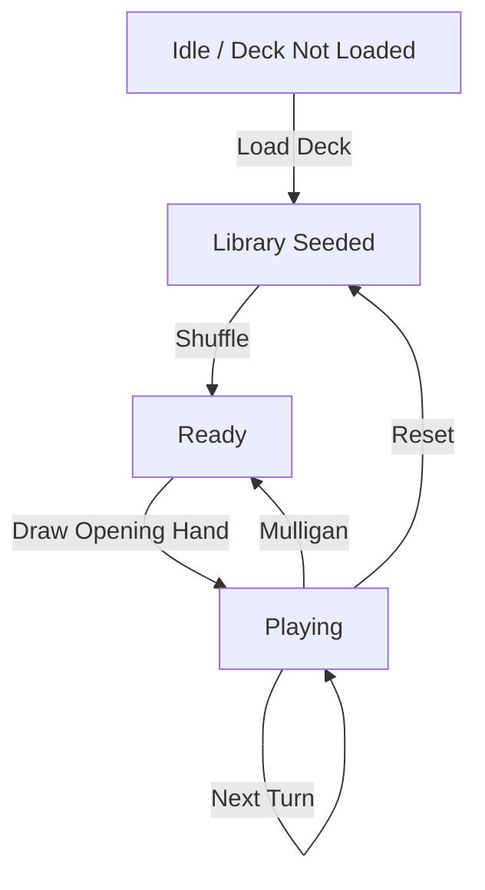

# Deck Simulator MVP (Phase 4)

_Last updated: 2025-09-28_

Metablazt's deck simulator lets players goldfish their lists without leaving the builder. This document captures the UX, state machine, and data requirements for the mainboard-only MVP.

## Goals

- Quick goldfish loop for a 60/99 card list using existing deck data.
- Fast mulligan workflow following London Mulligan (7 ? 6 ? 5 ? 4 ? 3) with automated bottoming prompts.
- Clear visualization of library, hand, battlefield, graveyard, exile, and the turn log.
- Persist the current simulation locally so users can resume later.
- Expose hooks for future Supabase sync (saved scenarios, multiplayer, analytics).

## Non-Goals (Phase 4)

- Sideboard, commander-specific zones, or stack interactions.
- Combat step automation; users move cards between zones manually once on the battlefield.
- Multiplayer state (keep single-player goldfish).
- Advanced rules enforcement (e.g., mana costs, life totals).

## UX Outline

1. **Deck intake**
   - Use the active draft from the deck builder or allow paste/import of a list (MTG Arena / text).
   - Deck builder includes an "Open simulator" CTA in the draft summary controls.
   - Show a validation summary (total cards, basic land counts) before starting.

2. **Simulator layout**
   - Left column: library + exile stacks (Card Bazaar stack styling).
   - Center: hand (horizontal scroll) and battlefield grid (card stacks grouped manually by the user).
   - Right column: graveyard stack, turn controls (draw, mulligan, next turn, reset), and action log.

3. **Controls**
   - `Draw Card`, `Draw 7`, `Mulligan` (prompts user to bottom cards), `Undo` (pop last action), `Next Turn`, `Reset Session`.
   - Future hooks: `Scry`, `Token`, `Add Counter`, `Life +/-`.

4. **Telemetry hooks**
   - Log simulator launches, mulligans, turns taken, and reset actions for future analytics.

## State Machine

- **Library**: array of `SimulatorCard` (id, name, quantity, image?)
- **Hand**: array in draw order.
- **Battlefield / Graveyard / Exile**: arrays with timestamp metadata for log.
- **Turn state**: `turn: number`, `phase: "precombat" | "postcombat"` (phase is future-proofed).
- **History**: stack of actions for undo capability (optional minimal implementation keeps last action details).

## Persistence

- Store session under `metablazt.simulator.session` in `localStorage`.
- Persist:
  - Loaded deck (card ids + quantities).
  - Current zone distributions.
  - Turn count and action log.
- Provide `clearSession()` that wipes local storage.

## Future Enhancements

- Sideboard/Commander zones + companion.
- Shared sessions stored in Supabase for collaborative testing.
- Rule enforcement (mana production, combat sequencing).
- Visual card animations and advanced stack handling.

